# 蘑菇博客

  

   蘑菇博客，一个基于微服务架构的前后端分离博客系统

<a target="_blank" href="https://www.oracle.com/technetwork/java/javase/downloads/index.html">
    	</img>
		</img>
        </img>
</img></img>
</img>
</img></a>

## 项目介绍
蘑菇博客，一个基于微服务架构的前后端分离博客系统。前台使用Vue + Element , 后端使用spring boot + spring cloud + mybatis-plus进行开发，使用  Jwt + Spring Security做登录验证和权限校验，使用ElasticSearch和Solr作为全文检索服务，使用Github Actions完成博客的持续集成。

- 从大学的时候开始，就一直想要搭建一套属于自己的博客系统，但是一直被没有去弄，现在时间多了，结合目前流行的技术栈，使用前后端分离架构进行项目的开发，也希望自己能够将项目一步步进行完善。
- 蘑菇博客大部分功能是我个人进行开发的，因能力有限，其中很多技术都是一边学习一边使用的，可以说蘑菇博客也是一个我用来熟悉技术的项目，所以很多地方可能考虑不周，在加上没怎么接触公司实际项目，故有能改正的地方，还请各位老哥能够指出~
- 现在挺多是SSM或者SSH的博客管理系统，想用spring boot + spring cloud  + vue 的微服务架构进行尝试项目的构建，里面很多功能可能只是为了满足自己的学习需求而引入的，因此本博客也是一个非常好的SpringBoot、SpringCloud以及Vue技术的入门学习项目。
- 由于原来做过vue + element-ui 做过管理系统，所以现在打算做一套自己的、基于当前最新技术栈、前后端分离的微服务博客系统。
- 考虑到门户网站使用Vue不是很好支持SEO优化，所以门户网站采用Nuxt.js进行开发（因部署时遇到问题，无法完成正常部署，故搁置...欢迎有了解nuxt或者SEO优化的老哥一起探讨~）

## 项目地址

目前项目托管在Gitee和Github平台上中，欢迎大家star 和 fork 支持~

- Gitee地址：https://gitee.com/moxi159753/mogu_blog_v2
- Github地址：https://github.com/moxi624/mogu_blog_v2

## 目录介绍

- MoguBlog 是一款基于最新技术开发的多人在线、简洁的博客系统。
- mogu_admin: 提供admin端API接口服务；
- mogu_web：提供web端API接口服务；
- mogu_eureka： 服务发现和注册
- mogu_picture： 图片服务，用于图片上传和下载；
- mogu_sms：消息服务，用于更新ElasticSearch、Solr索引、邮件和短信发送
- mogu_monitor：监控服务，集成SpringBootAdmin用于管理和监控SpringBoot应用程序
- mogu_search：搜索服务，ElasticSearch和Solr作为检索工具，可插拔配置
- mogu_utils: 是常用工具类；
- mogu_xo: 是存放 Entity，Service，Dao层的
- mogu_base: 是一些Base基类
- mogu_config: 是存放一些配置
- doc: 是蘑菇博客的一些文档和数据库文件
- vue_mogu_admin：VUE的后台管理页面
- vue_mogu_web：VUE的门户网站
- nuxt_mogu_web：Nuxt的门户网站

## 技术架构

- 后端采用的技术：SpringBoot、Spring cloud 、MyBatis-Plus、Spring Security + JWT、Solr, Redis , Mysql , Nginx , Swagger，Lombok、RabbitMQ，阿里大鱼、JustAuth、Druid、ElasticSearch、SpringBootAdmin、kibana
- 前端采用的技术： Vue，Nuxt， Element， ES6， CKEditor，Highlight
- 自动化运维：Docker、Github Actions

## 项目特点

- 友好的代码结构及注释，便于阅读及二次开发
- 实现前后端分离，通过Json进行数据交互，前端再也不用关注后端技术
- 利于SEO优化，让博客能够搜索到。
- 页面交互使用Vue2.x，极大的提高了开发效率。
- 引入swagger文档支持，方便编写API接口文档。
- 引入RabbitMQ消息队列，用于邮件发送、更新Redis和Solr
- 引入JustAuth第三方登录开源库，支持Gitee、Github账号登录。
- 引入ElasticSearch和Solr作为全文检索服务，并支持可插拔配置
- 引入Github Actions 完成蘑菇博客的持续集成、持续部署。

## Windows环境下搭建蘑菇博客

参考 [window环境下配置蘑菇博客环境](http://www.moguit.cn/#/info?blogUid=082ca226cf2e4103b0ffa6e6c13d7b14)，能够在window下搭建蘑菇博客的开发环境

## Docker搭建蘑菇博客

参考 [使用Docker快速搭建蘑菇博客](http://www.moguit.cn/#/info?blogUid=ab8377106a0d4b9f8d66131e4312c69e)，能够快速在服务器中，搭建好博客系统  

## 蘑菇博客部署到云服务器

参考[蘑菇博客如何部署到阿里云服务器](http://www.moguit.cn/#/info?blogUid=89defe3f4a3f317cba9aa0cdb9ff879e)，在你修改蘑菇博客源码后，将项目打包部署到云服务器

## 使用Github Actions完成蘑菇博客持续集成

参考 [使用Github Action完成蘑菇博客持续集成](http://moguit.cn/#/info?blogUid=0762bfb392c2cf0a94c8a7934fe46f8f) ，在你提交一个push请求后，通过Github Actions能够完成蘑菇博客自动化 编译、打包、部署等操作。

## 项目环境

- 安装 JDK（1.8+）
- 安装 Maven (3.3.0+)
- 安装Redis服务 (3.0+)
- 安装 MySQL (5.6+)
- 安装 Solr （7.0+）或 ElasticSearch（6.3.0）
- 安装 RabbitMQ （3.7.4）
- 安装 Erlang (20.3) （安装RabbitMQ还需要Erlang）
- 安装 Nginx
- 安装IDE （STS或IDEA）

## 启动顺序

mogu_eureka ->  mogu_picture -> mogu_sms -> mogu_admin -> mogu_web

## Docker容器中的初始用户和密码

- **后台登录**：用户：admin，密码：mogu2018
- **Mysql**：用户：root，密码：mogu2018
- **Redis**：密码：mogu2018
- **远程SSH初始密码**：用户：root，密码：mogu2018
- **RabbitMQ管理页面：** 用户：guest，密码：guest
- **Eureka管理页面：** 用户：user，密码：password123
- **蘑菇博客监控页面**：用户：user，密码：password123

## 致谢

- 感谢**杨青小姐姐**的博客模板，http://www.yangqq.com/
- 感谢**PanJiaChen**提供的**vue-element-admin**： https://github.com/PanJiaChen/vue-element-admin 
- Vue项目参考这篇博客：https://segmentfault.com/a/1190000009506097
- 感谢**苞米豆**提供的**Mybatis-plus**框架：http://mp.baomidou.com/
- 感谢**JetBrains**提供的免费开源License： https://www.jetbrains.com/?from=mogu_blog_v2 
- 感谢**yadong.zhang**提供的第三方登录开源库：https://gitee.com/yadong.zhang/JustAuth.git

## 关注&交流

刚刚创建了一个QQ群，目前项目还存在很多不足之处，欢迎各位老哥进群交流~

|                QQ群（备注：蘑菇博客）                 |               QQ（备注：蘑菇博客）               |
| :---------------------------------------------------: | :----------------------------------------------: |
|  |  |

## 将来要做的事

- [x] 集成Github Actions，完成蘑菇博客持续集成服务
- [x] 门户网站增加登录页面
- [x] 支持第三方登录
- [x] 集成ElasticSearch和Solr
- [ ] 将图片存储在七牛云中
- [ ] 写一个评论模块，用于替换搜狐畅言
- [ ] 解决Nuxt_mogu_web中存在的问题，使博客能被搜索引擎收录
- [ ] 前端增加用户模块
- [ ] 让原创文章能够同步到多平台，如：CSDN，掘金，博客园等

## 贡献代码

1. fork本项目到自己的repo
2. 把fork过去的项目也就是你仓库中的项目clone到你的本地
3. 修改代码
4. commit后push到自己的库
5. 发起PR（pull request） 请求，提交到`dev`分支
6. 等待作者合并

## 相关截图

- ### admin端

  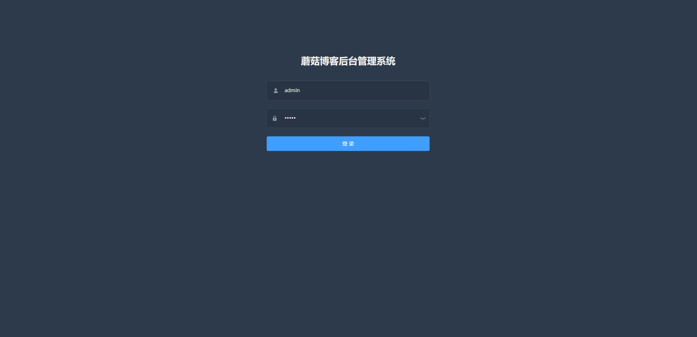

  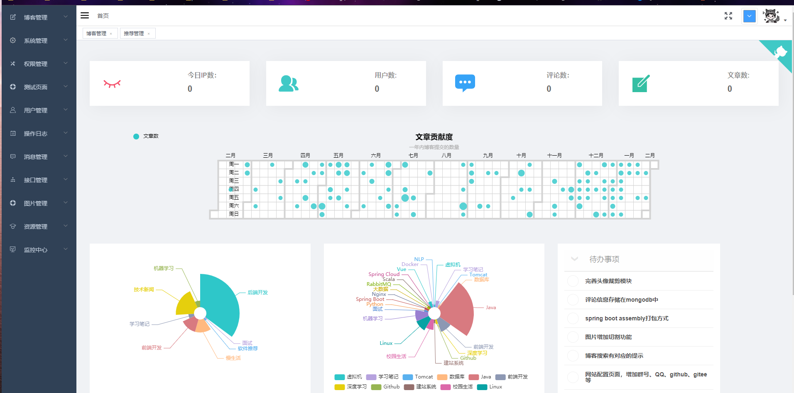

  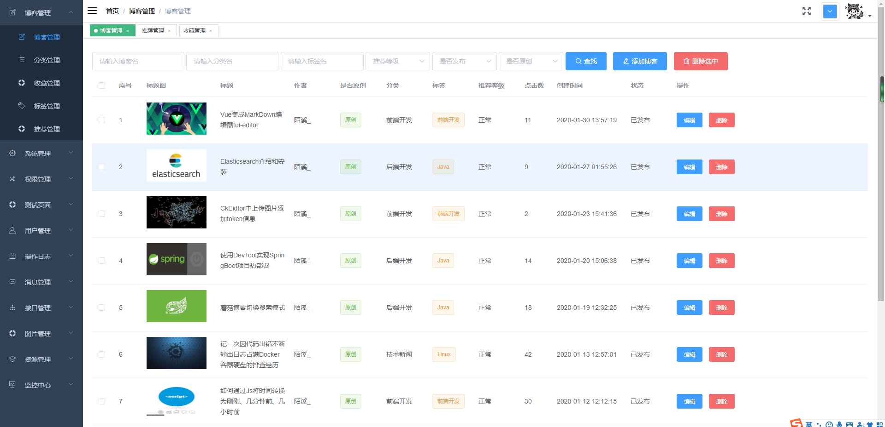
  
  
  
  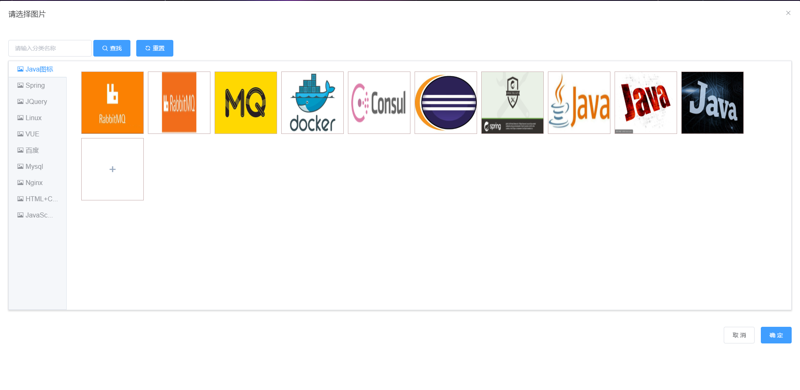
  
  
  
  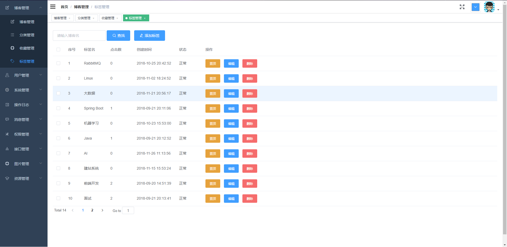

  
  
  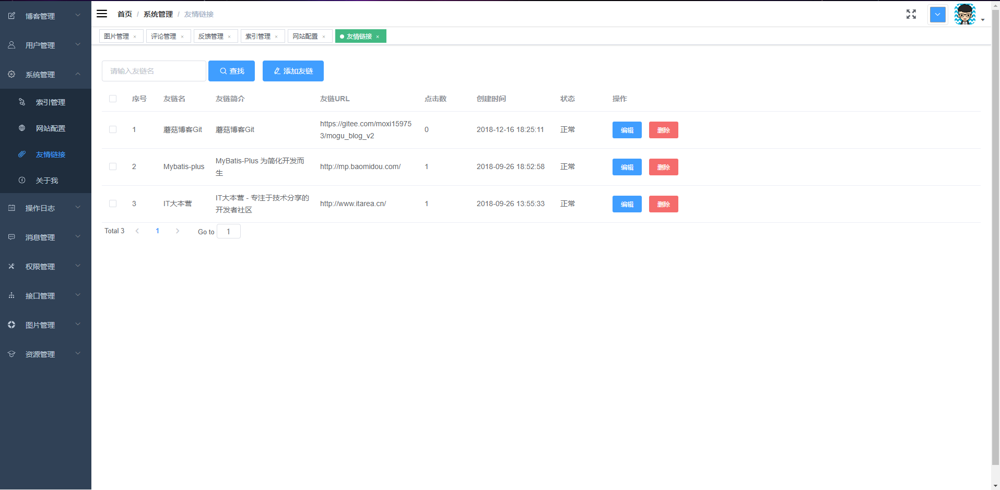

  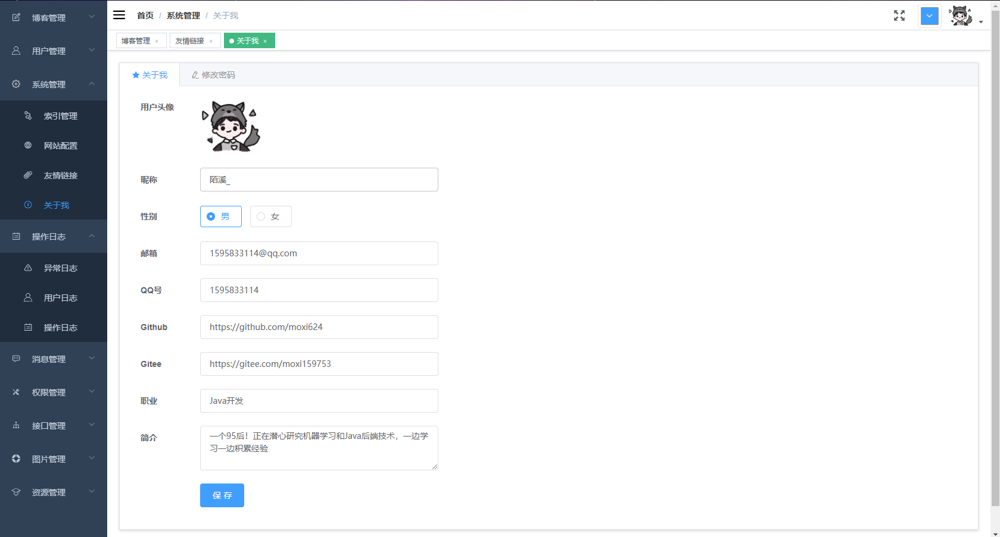
  
  
  
  
  
  
  
  
  
  
  
  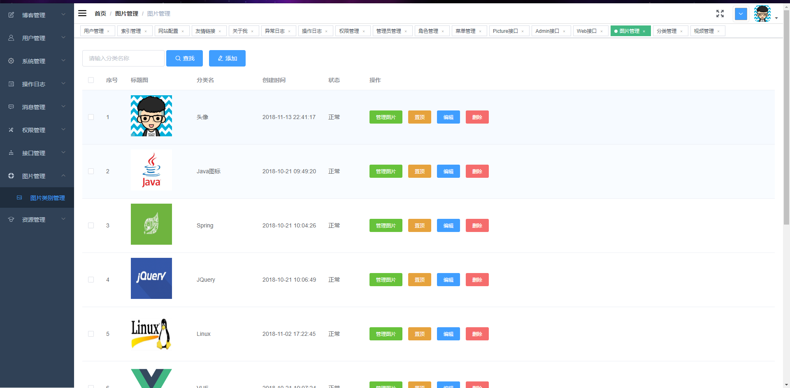
  
  
  
  
  
  

- ### Web端

  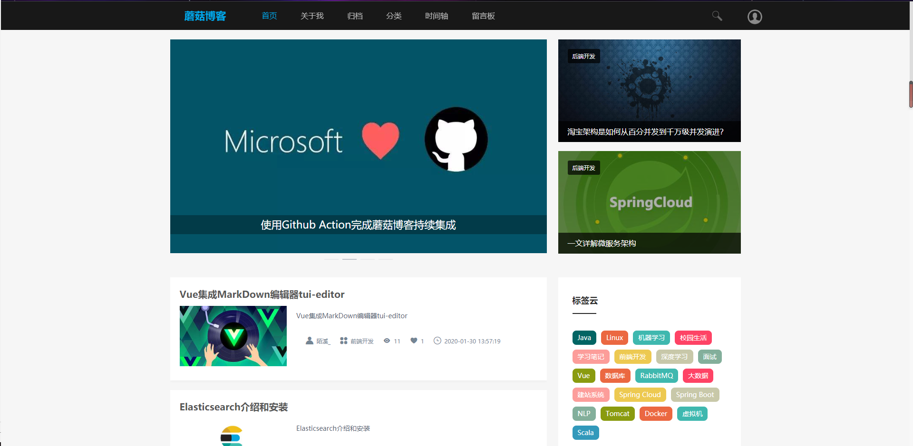

  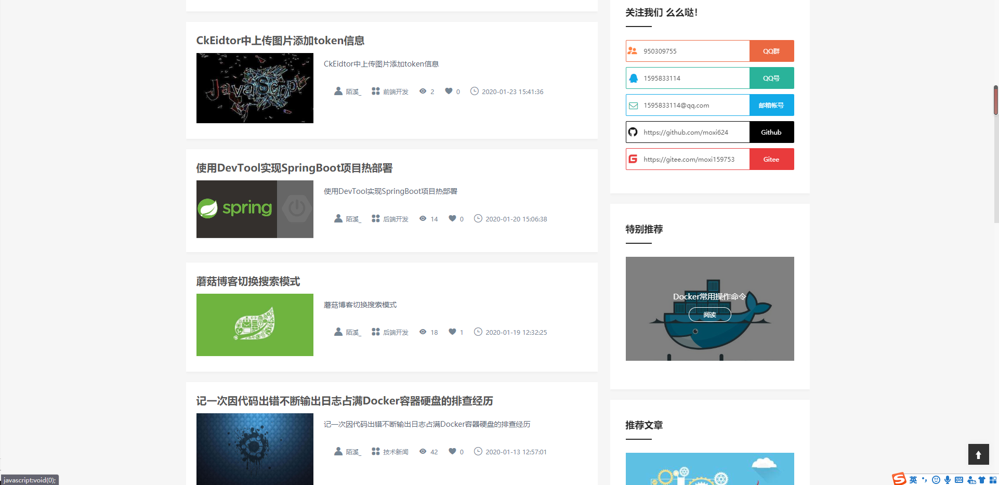
  
  

  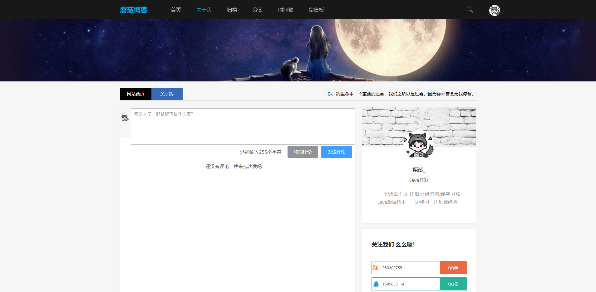

  
  
  
  
  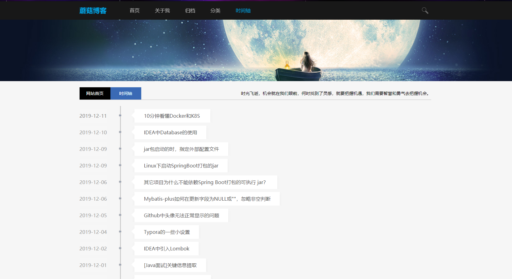

